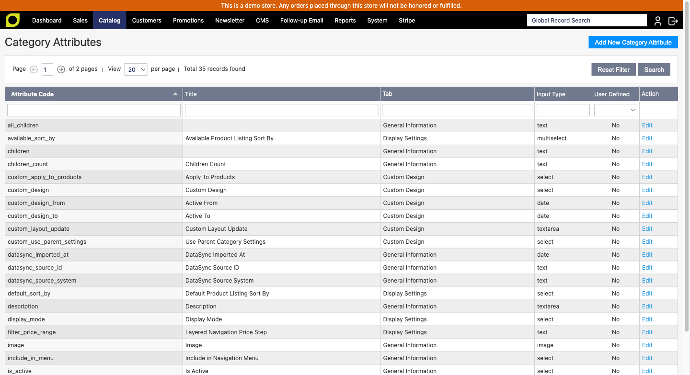
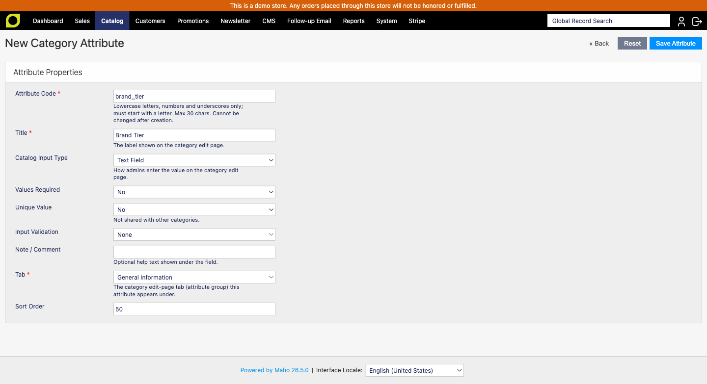

# MageAustralia_CategoryAttributes

Custom **category** attributes for [Maho](https://github.com/mahocommerce/maho) 26.5+.

Adds an admin UI to create and manage your own catalog-category EAV attributes - the category equivalent of product attributes - and to organise them into the tabs shown on the category edit page. It replaces the legacy `Delta_Deltacats` extension and the Mango "Custom Category Attributes" feature set with a single, modern, Maho-native module.



- PHP 8.3+, strict types throughout, modern Maho attribute routes (`#[Maho\Config\Route]`)
- No Prototype, no Zend, no Varien_Data on JS - vanilla JS only, `escapeHtml` / `escapeUrl` only
- OSL-3.0 (matches the Maho core base)

## Features

- **Create category attributes** - text, textarea, date, yes/no (boolean), dropdown (`select`), multiselect, and image input types.
- **Assign attributes to tabs** - each attribute belongs to a category-edit tab (an EAV attribute group). Attributes then render on the category edit page under their tab via Maho's native attribute-group rendering - no layout hacks.
- **Tab manager** - create, rename, reposition, and delete the category tabs (attribute groups) themselves.
- **Manage options** - dropdown and multiselect attributes get an inline manage-options grid: add options, edit the admin and per-store-view labels, set the default, reorder, and delete.
- **Edit and delete** - manage existing custom attributes from a single grid.

## Requirements

- PHP 8.3+
- Maho ^26.5

## Installation

```bash
composer require mageaustralia/maho-module-category-attributes
./maho cache:flush
```

## Usage

1. Go to **Catalog ▸ Category Attributes ▸ Manage Attributes** to create and edit category attributes.
   - Pick an input type (text, textarea, date, yes/no, dropdown, multiselect, image).
   - Choose the tab the attribute should appear under on the category edit page.
   - For dropdown / multiselect, manage the options (labels, default, order) in the grid.
2. Go to **Catalog ▸ Category Attributes ▸ Manage Tabs** to create, rename, reposition, or delete the category edit-page tabs.
3. Edit any category (**Catalog ▸ Manage Categories**) - your custom attributes appear under their assigned tab.

## Screenshots

| | |
|---|---|
|  |  |

## Development

CI: see `.github/workflows/ci.yml` - composer-validate + php-l + the maho-ci removed-Zend/Varien/Prototype scan via the shared `mageaustralia/maho-ci` reusable workflow.
